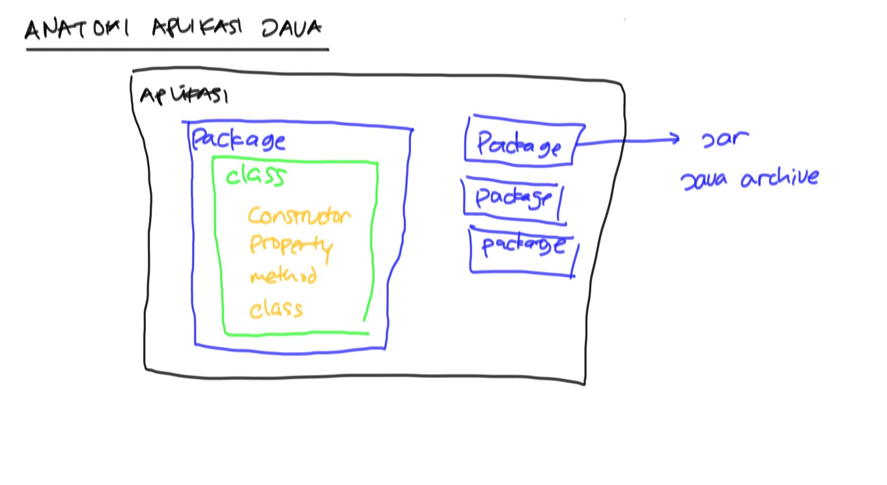
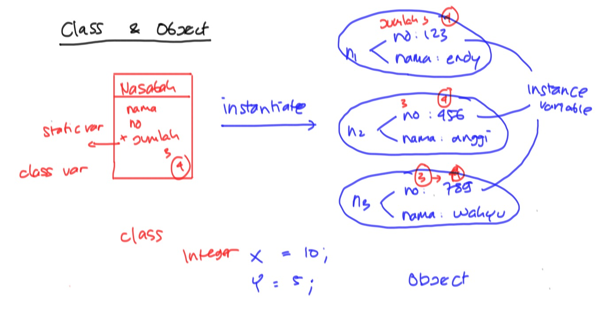

## Why Java? ##

* Penggunaan luas : web, mobile, desktop, background processing, dsb
* Library
* Ekosistem
* Mature
* Backward compatibility

## Kelengkapan coding Java ##

* Java SDK
* IDE
* Build Tools (Maven atau Gradle)

## Struktur Aplikasi Java ##

## Perintah Java SDK ##

* Compile source code

    javac NamaFile.java

* Menjalankan aplikasi (harus ada method `main`)

    java NamaClass

* Compile dan taruh hasilnya di folder `hasil`

        javac -d hasil c:/training/java/hari1/*.java

* Set classpath di command line option

        java -cp hasil NamaClass

* Set classpath di environment cmd (*Nix)

        export CLASSPATH=/Users/endymuhardin/hasil

* Set classpath di environment cmd (Windows)

        set CLASSPATH=c:/Users/endy/belajar

* Set classpath ke folder dan file jar (*Nix)

        export CLASSPATH=/Users/endymuhardin/belajar/hasil:/Users/endymuhardin/training.jar

* Set classpath ke folder dan file jar (Windows)

        set CLASSPATH=c:/Users/endy/belajar;c:/Users/endy/training.jar

## Class dan Object ##

* Class : tipe data buatan sendiri
* Why class?

    * Membuat tipe data sesuai business process. Misal : `Nasabah`, `Rekening`, `Mutasi`, dsb
    * Supaya kode program lebih mudah dipahami
* Object : variabel yang dibuat dari class tersebut. Disebut juga dengan istilah `instance`
* `static` : variabel/method yang terafiliasi dengan `class`
* `instance xxx` : variabel/method yang terafiliasi dengan `object`

## Multi Threading ##

* Eksekusi program dijalankan secara berbarengan. Tidak menunggu salah satu selesai dulu, baru yang satunya mulai.
* [Video pemrograman multithreading](https://www.youtube.com/playlist?list=PL9oC_cq7OYbyUQvRrEFjTfcfsGAMthQhq)
* [Contoh penggunaan multithreading dalam aplikasi chat](https://www.youtube.com/watch?v=Qn6xq6bDiv0)
